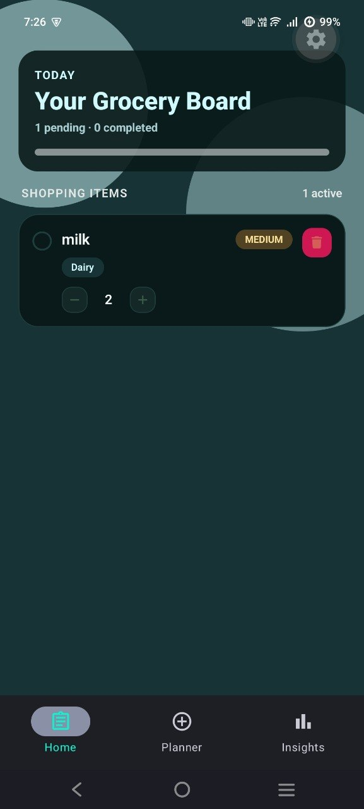
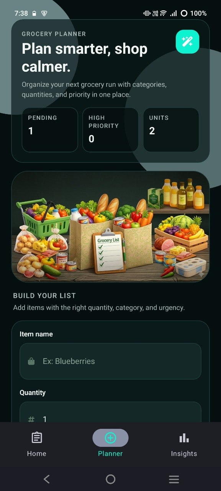
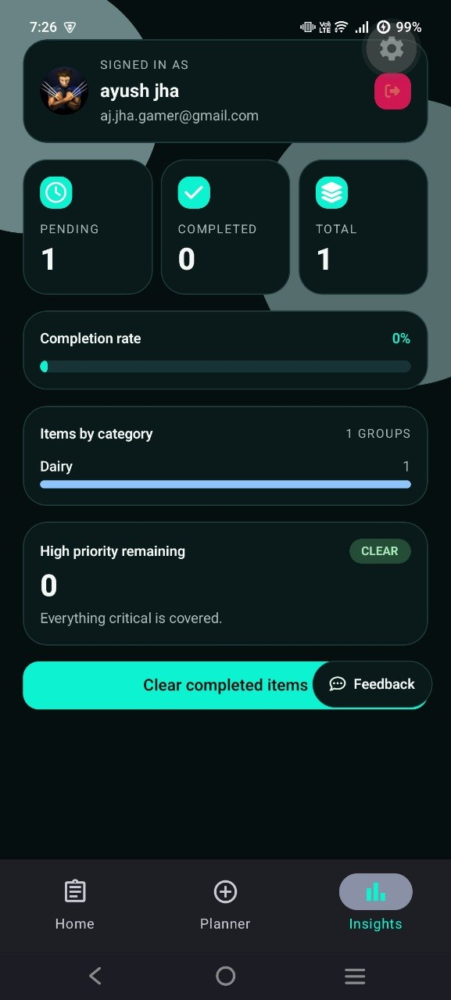
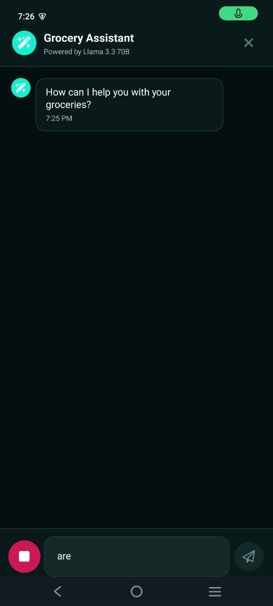
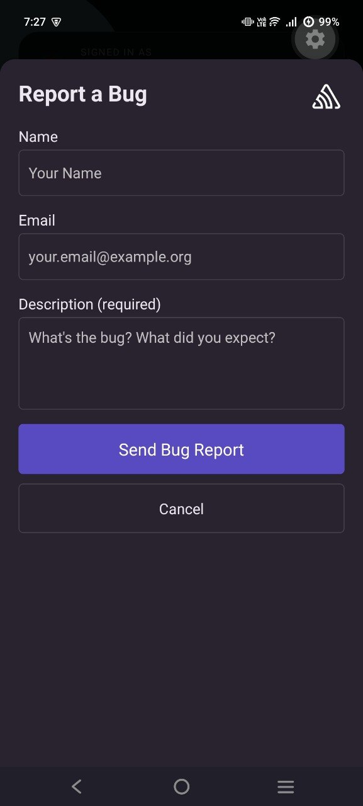

<div align="center">

# Grocify

**AI-Powered Smart Grocery Management App**

A full-stack cross-platform mobile application that combines intelligent grocery list management with an AI conversational agent, voice input, real-time analytics, and smart notifications — built with React Native, FastAPI, and LangChain.

[](https://reactnative.dev/)
[](https://expo.dev/)
[](https://fastapi.tiangolo.com/)
[](https://langchain.com/)
[](https://typescriptlang.org/)
[](https://neon.tech/)

</div>

---

## Screenshots

<div align="center">
<table>
  <tr>
    <td align="center"><br /><b>Grocery List</b></td>
    <td align="center"><br /><b>Planner</b></td>
    <td align="center"><br /><b>Insights & Analytics</b></td>
  </tr>
  <tr>
    <td align="center"><br /><b>AI Agent + Voice</b></td>
    <td align="center"><br /><b>Bug Report (Sentry)</b></td>
    <td></td>
  </tr>
</table>
</div>

---

## Features

### Grocery List Management
- Real-time shopping board with pending/completed item tracking
- Priority badges (Low / Medium / High) with color-coded indicators
- Category tags (Produce, Dairy, Bakery, Pantry, Snacks)
- Inline quantity controls with increment/decrement
- Collapsible completed items section with completion progress bar
- One-tap item deletion and purchase toggling

### Grocery Planner
- Structured item creation form with validation
- Icon-based category and priority selectors
- Quick stats dashboard — pending count, high-priority items, total units
- Real-time form validation with error feedback

### AI Grocery Assistant
- Conversational AI agent powered by **Llama 3.3 70B** via Groq
- **Tool-constrained architecture** — 3 bound LangChain tools (add item, remove item, get stats) preventing hallucinated actions
- Voice input via cloud-based speech recognition with interim results
- Multi-turn chat with session persistence (Redis, 30-min TTL)
- Full-screen chat modal with message history and timestamps

### Insights & Analytics
- Stats cards — Pending, Completed, Total items with completion rate
- Category-wise breakdown with horizontal progress bars
- High-priority item tracking with contextual messaging
- Bulk action to clear all completed items
- User profile display with sign-out (Clerk)

### Authentication
- Social OAuth via **Clerk** — Google, Apple, GitHub
- Secure token caching and protected route guards
- Branded sign-in screen with per-provider loading states

### Smart Notifications
- Auto-scheduled 5-hour reminders for pending grocery items
- Auto-cancelled when all items are marked purchased
- Custom Android notification channel with high importance
- Soft-prompt permission strategy for higher opt-in rates

### Observability
- **Sentry** integration for real-time crash reporting and error monitoring
- Native in-app bug report form with user feedback collection

---

## Tech Stack

| Layer | Technology |
|---|---|
| **Frontend** | React Native, Expo 55, Expo Router, TypeScript |
| **Styling** | NativeWind (Tailwind CSS) with light/dark theme support |
| **State Management** | Zustand |
| **Authentication** | Clerk Expo (OAuth SSO) |
| **Backend** | FastAPI, Uvicorn, Python 3.12 |
| **Database** | Neon Serverless PostgreSQL, SQLAlchemy (async) |
| **Session Store** | Redis (chat history persistence) |
| **AI / LLM** | LangChain, Groq (Llama 3.3 70B) |
| **Voice Input** | Expo Speech Recognition (cloud-based) |
| **Notifications** | Expo Notifications |
| **Error Tracking** | Sentry React Native |
| **Deployment** | Docker (multi-stage), EAS Build |

---

## Architecture

```
┌─────────────────────────────────────────────────────┐
│                   React Native App                  │
│  ┌───────────┐  ┌───────────┐  ┌────────────────┐  │
│  │  Home Tab  │  │ Planner   │  │  Insights Tab  │  │
│  │  (List)    │  │   Tab     │  │  (Analytics)   │  │
│  └─────┬─────┘  └─────┬─────┘  └───────┬────────┘  │
│        │               │                │           │
│  ┌─────┴───────────────┴────────────────┴─────┐     │
│  │           Zustand Store + Services          │     │
│  └─────────────────────┬──────────────────────┘     │
│                        │                            │
│  ┌─────────────────────┴──────────────────────┐     │
│  │         AI Agent Modal + Voice Input        │     │
│  └─────────────────────┬──────────────────────┘     │
└────────────────────────┼────────────────────────────┘
                         │ REST API
┌────────────────────────┼────────────────────────────┐
│                   FastAPI Backend                    │
│  ┌─────────────┐  ┌───┴────────┐  ┌─────────────┐  │
│  │  CRUD API   │  │  AI Agent  │  │   Health     │  │
│  │  /api/items │  │  LangChain │  │   /health    │  │
│  └──────┬──────┘  └──────┬─────┘  └─────────────┘  │
│         │                │                          │
│  ┌──────┴──────┐  ┌──────┴──────┐                   │
│  │    Neon     │  │    Redis    │                    │
│  │  PostgreSQL │  │  Sessions   │                    │
│  └─────────────┘  └─────────────┘                   │
└─────────────────────────────────────────────────────┘
```

---

## Getting Started

### Prerequisites

- Node.js v18+
- Python 3.12+
- Expo CLI
- Android Studio / Xcode
- Redis instance
- Neon PostgreSQL database

### Frontend Setup

```bash
git clone https://github.com/your-username/Grocify.git
cd Grocify
npm install
```

Create a `.env` file in the project root:

```env
EXPO_PUBLIC_CLERK_PUBLISHABLE_KEY=your_clerk_key
EXPO_PUBLIC_SENTRY_DSN=your_sentry_dsn
SENTRY_AUTH_TOKEN=your_sentry_auth_token
EXPO_PUBLIC_BACKEND_URL=http://your-local-ip:8000
```

Start the development server:

```bash
npx expo start
```

Run on Android:

```bash
npx expo run:android
```

### Backend Setup

```bash
cd Grocify-backend
pip install -r requirements.txt
```

Create a `.env` file in the backend directory:

```env
DATABASE_URL=your_neon_postgres_url
GROQ_API_KEY=your_groq_api_key
REDIS_HOST=your_redis_host
REDIS_PORT=your_redis_port
REDIS_PASSWORD=your_redis_password
ALLOWED_ORIGINS=http://localhost:8081
PORT=8000
```

Run the backend:

```bash
uvicorn main:app --host 0.0.0.0 --port 8000 --reload
```

### Docker (Backend)

```bash
cd Grocify-backend
docker build -t grocify-backend .
docker run -p 8000:8000 --env-file .env grocify-backend
```

---

## Production Build

Generate a standalone Android APK:

```bash
npx expo run:android --variant release
```

Or use EAS for cloud builds:

```bash
eas build -p android --profile preview
```

---

## Project Structure

```
Grocify/
├── src/
│   ├── app/
│   │   ├── (auth)/          # Authentication screens
│   │   ├── (tabs)/          # Main tab screens (Home, Planner, Insights)
│   │   └── _layout.tsx      # Root layout with Clerk + Sentry providers
│   ├── components/
│   │   ├── ai-agent/        # AI chat modal, FAB, voice input
│   │   ├── insights/        # Analytics cards, profile, category charts
│   │   ├── List/            # Grocery list items, hero card, summary
│   │   └── planner/         # Planner form, hero image, stats
│   ├── services/            # API clients (grocery CRUD, AI agent)
│   ├── store/               # Zustand global state
│   ├── lib/                 # Notification scheduling utilities
│   └── types/               # TypeScript type definitions
├── Grocify-backend/
│   ├── main.py              # FastAPI app + route definitions
│   ├── agent.py             # LangChain AI agent setup
│   ├── tools.py             # Bound tool definitions (add, remove, stats)
│   ├── crud.py              # Database CRUD operations
│   ├── models.py            # Pydantic request/response schemas
│   ├── db_models.py         # SQLAlchemy ORM models
│   ├── database.py          # Async database session config
│   ├── redis_session.py     # Redis chat history management
│   └── Dockerfile           # Multi-stage production container
├── Screenshots/             # App screenshots
└── .env                     # Environment variables
```

---

<div align="center">

**Built with React Native + FastAPI + LangChain**

</div>
